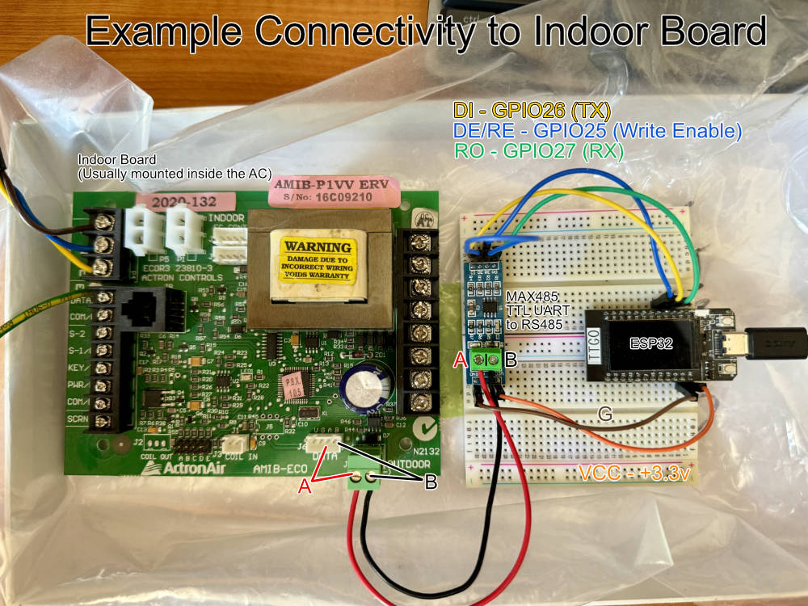

# Actron485
PlatformIO library to control ActronAir Air conditioners directly via the RS485 bus

**========== DISCLAIMER WARNING ==========**  
Interfacing an ESP32 with an Actron air conditioner is out of specifications and not    
condoned by the manufacturer and may void warranty and cause permanent damage.   
Authors of these instructions and code as well as ActronAir are not responsible for   
any damage that may occur with the use of this project directly or indirectly.   
**USE AT YOUR OWN RISK!!!**

## Introduction
This all started as I was sick of the un-reliability of the [ACM-1](https://www.manualslib.com/manual/1654680/Actronair-Acm-1.html) wireless module and had purchased a [ICAMIB-MOD](https://actronair.com.au/wp-content/uploads/2020/12/9590-3012-ICAMIB-MOD-Installation-and-Comm-Guide.pdf) MODBUS controller to replace it. And had started writing code to ESP32 code interface with it (another project). But as [this intermediate server hack](https://blog.mikejmcguire.com/2018/12/19/actronconnect-and-home-assistant/) came out, the ACM-1 module had been rerunning reliably, thus motivation to continue on with the MODBUS controller had dropped. The only real befit gained from the MODBUS controller would be better statistics and ESP fan mode.

I upgraded my system to Ultima, where individual zones could be temperature controlled. My biggest issues was that the temperatures could not be set remotely per zone. Spotting the RS485 chip on the LM-ZC-2W, I thought surely there be a way to send something down to change the temperature. With an oscilloscope, logic analyser, an RS485 USB serial adaptor, and a lot of head banging I was able to decode the communications between these little wall controllers and the main unit. In the process discovered more than I set out to. So here we are with a general purpose RS485 controller for a range of ActronAir conditioners.

## Requirements
### Hardware
* An ActronAir conditioner compatible with ACM-1, ACM-2 or ICAMIB-MOD control modules
* An ESP32 with a power supply
* An RS485 module (ideally a direct MAX485 with RO/RE/DE/DI, not serial converter)
* Wire to connect ESP32 and RS485 together.
* 2 core cable to connect the RS485 A/B to the Actron A/B bus (indoor, outdoor, or zone controller)

## Features

This module can be used to control a whole system such as an ACM-1/2 does or as a replacement in lieu of an LM-ZC zone wall controller. 

When using as an LM-ZC, one can replace the entire unit with a touch screen controller + temperature sensor to allow for better multi purpose control in that room or use a single ESP32 to control the temperatures in every room with distributed wireless temperature sensors. Useful if wanting to retrofit/upgrade to an Ultima system without having to wire up new controllers.

See examples folder for example usage. Header files such `Actron485.h` and `Actron485Models.h` are documented on how to use. Only use `setControlZone()` if the controller is replacing the zone wall controller. If the zone wall controller is still connected there will be clashes on the RS485 bus, causing the air conditioner to error and can also break cheap chinese RS485 transceiver chips.

### Control and Reading
* Turn `ON` and `OFF` the system
* Set the main `SET POINT` temperature of the system
* Set fan speed `LOW`/`MEDIUM`/`HIGH`/`ESP`
* Set the fan speeds with or without `CONTINUOUS` mode on
* Set the operating mode `OFF`/`AUTO`/`COOL`/`HEAT`/`FAN ONLY`
* Turn `ON`/`OFF` individual zones
* Set the `SET POINT` of individual zones (Ultima systems only)

### Reading Only
* Read main temperature 
* Read if compressor is running and if cooling or heating
* Read individual zone temperatures (Ultima systems only)
* Read individual zone statistics e.g. damper position, open mode, requesting compressor (Ultima systems only)

### Wiring Up

**WARNING** Turn off the power from the main switch at the outdoor unit before removing covers and touching any wiring as the 240V mains power is exposed. Switching off the power will prevent electrical shock and reduce the risk of damaging your air conditioner.

Wiring up the A/B from the MAX485 TTL UART to the Air conditioner. There wil be multiple places to connect the wires to on the AC side.
1. Indoor board DATA header e.g. pins 3 (A) 4 (B) shown in the photo
2. Indoor board to outdoor connection A/B
3. Outdoor board to indoor Connection A/B

There are ESP32 available with built in RS485 connectivity. Connecting an external MAX485 TTL UART, connect the following:
* DI to the TX GPIO
* RO to the RX GPIO
* DE and !RE together to the Write enable GPIO

If running out of pins on the ESP32, TX and RX can be joined and be configured to run on a single wire serial.

## Notes
* One command per cycle can be sent (~1s per cycle). Different commands are stored and sent out one by one at the end of a cycle. E.g. setting 8 zone temperatures, takes 8 seconds to complete.
* If a command is scheduled to be sent out, but in the mean time another command of the same type is set, the original command will be ignored. E.g. `turn system off` command is scheduled, but before it has time to be sent a `turn system on` command is scheduled, it will replace the off command.
* If another user is pressing buttons on a wall controller while also a message is being sent via this controller, a race condition could occur and one may override the other. E.g. Wall zone 1 is turned on, at the same time zone 2 is turned on in this controller. Zone 1 or 2 may turn off again.

## Todo
* Testing! Code is new and largely untested 
* Decode more data. Should be able retrieve all statistics that the [ICAMIB-MOD](https://actronair.com.au/wp-content/uploads/2020/12/9590-3012-ICAMIB-MOD-Installation-and-Comm-Guide.pdf) module can read 
* ESPHome Lib

Open issues or merge requests on any bugs found and improvements.
